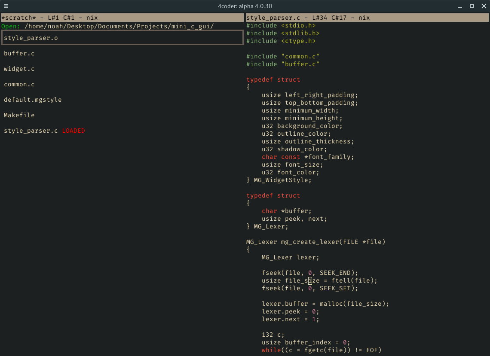
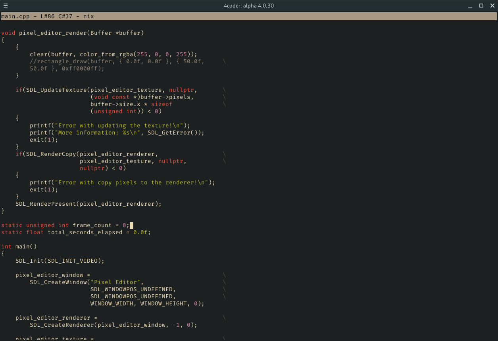
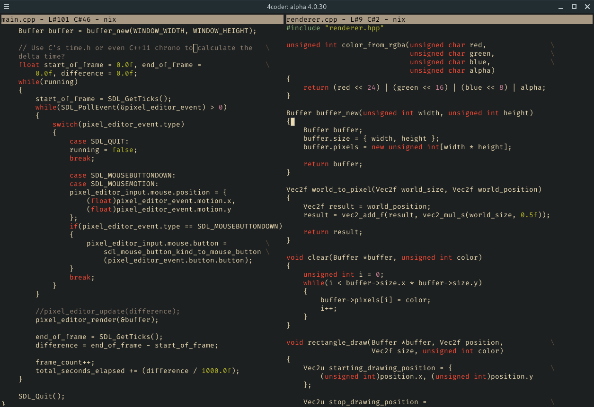

## Gruvbox Theme for 4coder

# WARNING
This colorscheme does not work for newer versions of 4coder like 4.1.6.

**NOTE: Github thinks 4coder theme files are Roff files apparently.**

Gruvbox is one of my favorite colorschemes to use in any editor and have used it in Neovim, Kakoune, and Vis. Now I've finally came around to make one for 4coder. Everything is mostly done but updates and tweaks will come in the following week(s). If you have an issue, file one and if you can improve the theme, request me to pull your changes in.

Based on this Gruvbox provided by the nice people at Vis: https://raw.githubusercontent.com/samlwood/vis-gruvbox/master/gruvbox.lua

### Screenshots

